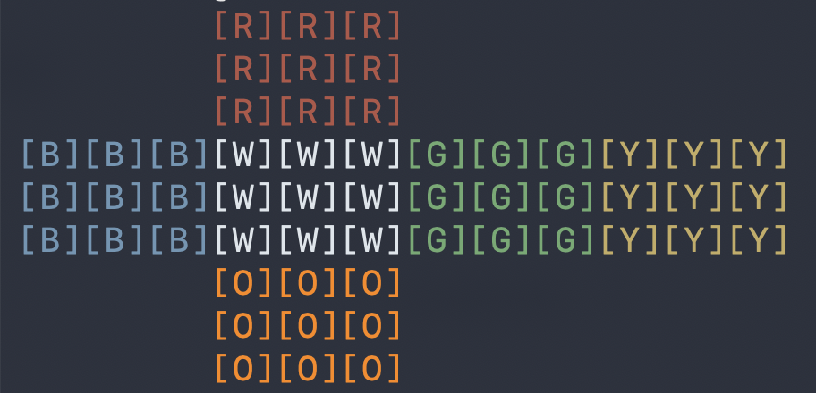

# Rubik's Cube Solver / Solveur de Rubik's Cube

---
### Preview


## English

### Description
A Rubik's cube solver written in C. The program shuffles a cube, displays it in the terminal, and animates the solution step-by-step.

### Features
- Cube initialization and display in terminal
- Random shuffle
- Layer-by-layer solver
- Step-by-step animation with 3 second delay between each move

### Requirements
- GCC
- Make

### Installation
```bash
git clone https://github.com/nicolasbgt-cell/Rubiks_Cube.git
cd Rubiks_Cube
make
./rubiks
```

### Project Structure
```
Rubiks_Cube/
├── cube.h          # Defines, colors, t_cube struct
├── cube_init.c     # Cube initialization
├── display.c       # Terminal display
├── move.c          # Face rotations
├── shuffle.c       # Random scramble
├── solver.c        # Layer-by-layer solver
├── main.c          # Entry point
├── Makefile
└── README.md
```

### Author
Nicolas Bigot — École 42 Paris

### ☕ Support
👉 https://ko-fi.com/nicolasbgt

---

## Français

### Preview


### Description
Un solveur de Rubik's cube écrit en C. Le programme mélange un cube, l'affiche dans le terminal et anime la résolution étape par étape.

### Fonctionnalités
- Initialisation et affichage du cube dans le terminal
- Mélange aléatoire
- Résolution couche par couche
- Animation étape par étape avec 3 secondes entre chaque mouvement

### Prérequis
- GCC
- Make

### Installation
```bash
git clone https://github.com/nicolasbgt-cell/Rubiks_Cube.git
cd Rubiks_Cube
make
./rubiks
```

### Structure du projet
```
Rubiks_Cube/
├── cube.h          # Defines, couleurs, struct t_cube
├── cube_init.c     # Initialisation du cube
├── display.c       # Affichage terminal
├── move.c          # Rotations des faces
├── shuffle.c       # Mélange aléatoire
├── solver.c        # Solveur couche par couche
├── main.c          # Point d'entrée
├── Makefile
└── README.md
```

### Auteur
Nicolas Bigot — École 42 Paris

### ☕ Soutenir le projet
👉 https://ko-fi.com/nicolasbgt

---

## 📄 License / Licence

MIT License

Copyright (c) 2026 Nicolas Bigot

Permission is hereby granted, free of charge, to any person obtaining a copy
of this software and associated documentation files (the "Software"), to deal
in the Software without restriction, including without limitation the rights
to use, copy, modify, merge, publish, distribute, sublicense, and/or sell
copies of the Software, and to permit persons to whom the Software is
furnished to do so, subject to the following conditions:

The above copyright notice and this permission notice shall be included in all
copies or substantial portions of the Software.

THE SOFTWARE IS PROVIDED "AS IS", WITHOUT WARRANTY OF ANY KIND, EXPRESS OR
IMPLIED, INCLUDING BUT NOT LIMITED TO THE WARRANTIES OF MERCHANTABILITY,
FITNESS FOR A PARTICULAR PURPOSE AND NONINFRINGEMENT. IN NO EVENT SHALL THE
AUTHORS OR COPYRIGHT HOLDERS BE LIABLE FOR ANY CLAIM, DAMAGES OR OTHER
LIABILITY, WHETHER IN AN ACTION OF CONTRACT, TORT OR OTHERWISE, ARISING FROM,
OUT OF OR IN CONNECTION WITH THE SOFTWARE OR THE USE OR OTHER DEALINGS IN THE
SOFTWARE.
