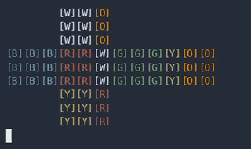

# Rubik's Cube Solver / Solveur de Rubik's Cube

---
### Preview
<div align="center">
  
</div>

## English

### Description
A Rubik's cube solver written in C. The program shuffles a cube, displays it in the terminal, and animates the solution step-by-step.

### Features
- Cube initialization and display in terminal
- Random shuffle
- Layer-by-layer solver
- Step-by-step animation between each move

### How the solver works
The cube is solved with **white on the UP face**. Centers: FRONT = red, RIGHT = green, BACK = orange, LEFT = blue.

#### 1. White cross (`strategy.c`)
`ft_solver` calls `ft_solve_white_cross` in a loop until `ft_white_cross` returns true (the 4 white edges on UP, each matching its side center). Each iteration does two things:
1. **`ft_to_down`** — finds one white edge that is not solved and plays a single move to bring it to the DOWN face, white sticker facing down:
   - edge in the middle layer → one turn of the adjacent face (e.g. white on `FRONT[1][0]` → `L`);
   - edge on the top layer with white facing sideways → turn that face (`F`, `R`, `B`, `L'`) to send it into the middle layer;
   - edge on the bottom layer with white facing sideways → turn that face to flip it, or `D` if the slot above is already solved;
   - white edge on UP but badly placed → double turn (`F2`, `R2`…) to send it down.
2. **`ft_align_down`** — if a white edge is on DOWN, reads its second color, turns `D` until the edge is under the matching center, then does a double turn of that face (`F2`, `R2`, `B2` or `L2`) to bring it up into place.

#### 2. White corners (`corner.c` → `corner4.c`)
`ft_find_corner` returns the position (slot) of a given corner: `0` UFR, `1` UFL, `2` UBL, `3` UBR, `4` DFR, `5` DFL, `6` DBL, `7` DBR.
Each corner is solved with the same 3-step method:
1. If the corner is stuck in **another** top slot, `ft_corner_to_down` kicks it out to the bottom layer (`X D X'`: down, step aside, put the cross edge back).
2. Turn `D` until the corner is right **under its target slot**.
3. Repeat the "sexy move" for that slot until the corner is solved (max 6 times).

| Corner | Colors | Target | Bottom slot | Repeated algorithm | File |
|---|---|---|---|---|---|
| 1 | white-red-green | UFR | DFR | `R' D' R D` | `corner.c` |
| 2 | white-red-blue | UFL | DFL | `L D L' D'` | `corner2.c` |
| 3 | white-orange-green | UBR | DBR | `B' D' B D` | `corner3.c` |
| 4 | white-orange-blue | UBL | DBL | `L' D' L D` | `corner4.c` |

The algorithm only touches its own slot and the bottom layer, so the cross and the corners already placed stay solved.

### Requirements
- GCC
- Make

### Installation
```
git clone https://github.com/nicolasbgt-cell/Rubiks_Cube.git
cd Rubiks_Cube
make
./rubiks
```

### Project Structure
```
Rubiks_Cube/
├── assets/         # Demo GIF and other media
├── cube.h          # Defines, colors, t_cube struct
├── cube_init.c     # Cube initialization
├── display.c       # Terminal display
├── move.c          # Face rotations
├── shuffle.c       # Random scramble
├── strategy.c      # White cross
├── corner.c        # Corner search + 1st white corner (UFR)
├── corner2.c       # 2nd white corner (UFL)
├── corner3.c       # 3rd white corner (UBR)
├── corner4.c       # 4th white corner (UBL)
├── solver.c        # Solver entry point / orchestration
├── main.c          # Entry point
├── Makefile
└── README.md
```

### Author
Nicolas Bigot — École 42 Paris

### Support
https://ko-fi.com/nicolasbgt

---

## Français

### Preview
<div align="center">
  
</div>

### Description
Un solveur de Rubik's cube écrit en C. Le programme mélange un cube, l'affiche dans le terminal et anime la résolution étape par étape.

### Fonctionnalités
- Initialisation et affichage du cube dans le terminal
- Mélange aléatoire
- Résolution couche par couche
- Animation étape par étape

### Fonctionnement du solveur
Le cube est résolu avec **le blanc sur la face UP**. Centres : FRONT = rouge, RIGHT = vert, BACK = orange, LEFT = bleu.

#### 1. Croix blanche (`strategy.c`)
`ft_solver` appelle `ft_solve_white_cross` en boucle jusqu'à ce que `ft_white_cross` renvoie vrai (les 4 arêtes blanches sur UP, chacune alignée avec le centre de sa face). Chaque tour de boucle fait deux choses :
1. **`ft_to_down`** — cherche une arête blanche pas encore placée et joue un seul mouvement pour l'amener sur la face DOWN, blanc vers le bas :
   - arête dans la couronne du milieu → un quart de tour de la face voisine (ex. blanc en `FRONT[1][0]` → `L`) ;
   - arête en haut avec le blanc sur le côté → on tourne cette face (`F`, `R`, `B`, `L'`) pour l'envoyer au milieu ;
   - arête en bas avec le blanc sur le côté → on tourne cette face pour la retourner, ou `D` si la case du dessus est déjà bonne ;
   - arête blanche sur UP mais mal placée → double tour (`F2`, `R2`…) pour la redescendre.
2. **`ft_align_down`** — si une arête blanche est sur DOWN, on lit sa deuxième couleur, on tourne `D` jusqu'à la placer sous le bon centre, puis on fait un double tour de cette face (`F2`, `R2`, `B2` ou `L2`) pour la remonter à sa place.

#### 2. Coins blancs (`corner.c` → `corner4.c`)
`ft_find_corner` renvoie la position (slot) d'un coin : `0` UFR, `1` UFL, `2` UBL, `3` UBR, `4` DFR, `5` DFL, `6` DBL, `7` DBR.
Chaque coin est résolu avec la même méthode en 3 étapes :
1. Si le coin est coincé dans **un autre** emplacement du haut, `ft_corner_to_down` le fait descendre (`X D X'` : on descend, on l'écarte, on remonte l'arête de la croix).
2. On tourne `D` jusqu'à ce que le coin soit **juste sous sa cible**.
3. On répète le « sexy move » de cet emplacement jusqu'à ce que le coin soit bon (6 fois max).

| Coin | Couleurs | Cible | Slot du bas | Algo répété | Fichier |
|---|---|---|---|---|---|
| 1 | blanc-rouge-vert | UFR | DFR | `R' D' R D` | `corner.c` |
| 2 | blanc-rouge-bleu | UFL | DFL | `L D L' D'` | `corner2.c` |
| 3 | blanc-orange-vert | UBR | DBR | `B' D' B D` | `corner3.c` |
| 4 | blanc-orange-bleu | UBL | DBL | `L' D' L D` | `corner4.c` |

L'algo ne touche que son emplacement et la couche du bas, donc la croix et les coins déjà placés restent résolus.

### Prérequis
- GCC
- Make

### Installation
```
git clone https://github.com/nicolasbgt-cell/Rubiks_Cube.git
cd Rubiks_Cube
make
./rubiks
```

### Structure du projet
```
Rubiks_Cube/
├── assets/         # GIF de démo et autres médias
├── cube.h          # Defines, couleurs, struct t_cube
├── cube_init.c     # Initialisation du cube
├── display.c       # Affichage terminal
├── move.c          # Rotations des faces
├── shuffle.c       # Mélange aléatoire
├── strategy.c      # Croix blanche
├── corner.c        # Recherche de coin + 1er coin blanc (UFR)
├── corner2.c       # 2e coin blanc (UFL)
├── corner3.c       # 3e coin blanc (UBR)
├── corner4.c       # 4e coin blanc (UBL)
├── solver.c        # Point d'entrée / orchestration du solveur
├── main.c          # Point d'entrée
├── Makefile
└── README.md
```

### Auteur
Nicolas Bigot — École 42 Paris

### Soutenir le projet
https://ko-fi.com/nicolasbgt